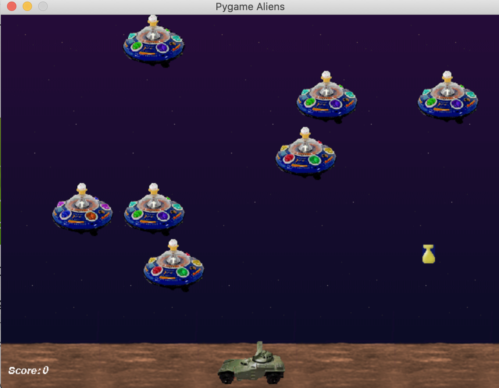
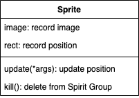
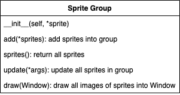
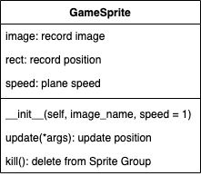
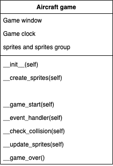

# Aircraft War

This is the game I have done when I learn python, all of these are create by Mac OS

## Preparation

1. #### Pycharm 2020.1( I think other vision is also fine)


2. #### Pygame 2.0.0  **You must install v2.0.0+ in oder to success **

   1. There are two ways to install pygame
      1. Terminal -> ```python3 -m pip install -U pygame==2.0.0.dev6 --user```
      2. Pycharm -> Preference -> Project -> Project Interpreter -> + ->search pygame -> specify v2.0.0+
   2. Then, use `python3 -m pygame.examples.aliens` to check if it is install successfully, if sucessful, it will run a game on your laptop.

   

3. #### Mac OS Catalina v 10.15.5

   1. In this project, all the thing is based on MacOS

4. #### The image folder

   1. This is the folder contains all the images we need

<br>

### Step 1: Use pygame to create GUI

1. #### Game init and quit   *(LN_01)*

```python
import pygame

pygame.init()			#init 
print("Game Coding...")	#coding
pygame.quit()			#quit
```

2. #### Know coordinates   *(LN_02)*

   1. ```pygame.Rect(x,y,weith,height)``` is used to create a rectangle.
   2. Upper left corner  is the origin (0,0). We can set all object based on that origin.

3. #### Create main window  *(LN_03)*

   1. ```pygame.display```

      | `pygame.display.set_mode((width,height),flags,depth)` | Initilize the window        |
      | ----------------------------------------------------- | --------------------------- |
      | `pygame.display.update()`                             | update the things in window |

<br>

### Step 2: Use image folder

1. #### Load the image (image.load)

   1. Use   ```pygame.image.load()``` to load image

2. #### Allocate the image (window.blit)

   1. Use the windows object to use ```window.blit(image object,(width,height))``` method to allocate the image

3. #### Update all the window and see the outcome (display.update)

   1. Use```pygame.display.update()``` to update all the window and see the outcome

4. #### Example *(LN_04)* *(LN_05)*

   1. Create background  *(LN_04)*
   2. Create heroplane  *(LN_05)*

<br>

### Step 3: Make image move and Game loop

1. #### How to make image move?

   1. Refresh frame to make image move

2. #### We have two things to do when we make a game

   1. Game init:
      1. Set up windows (Step 1)
      2. Create image and allocate them (Step 2)
      3. Time clock

   1. Game loop:
      1. Set refresh rate
      2. Check User Input
      3. Update image location
      4. Pygame.display.update  *(All)*

3. #### Time clock *(LN_06)*

   1. when in game init, use ```pygame.time.Clock``` to create a clock object
   2. when in game lopp, let clock object use ```tick``` method

4. #### Make heroplane move  *(LN_07)*

   1. use rect to remember the position of hero
   2. change  position of hero
   3. use blit method(**Remember to blit the background also in order to have only one plane**)
   4. use update method
   5. make hero plane will come back from the buttom

5. #### Check user input in game loop *(LN_08)*

   1. use ```pygame.event.get() -> list of input``` to get the current user input

   2. how to check the quit user input

      ```python
      for event in pygame.event.get():
          if event.type == pygame.QUIT:
              pygame.quit()
              exit()
      ```

   <br>

   ### Step 4: Sprite and Sprite group (OOP)

1. #### Sprite is a object that combine image and rect location together (Easy way)

   1. Game init:
      1. Create sprite
      2. Create sprites group
   2. Game loop:
      1. Update sprites group
      2. draw sprites group on window
      3. update the window

<div align=center>
   
</div>

<div align=center></div>

2. #### Create GameSprite class  *(GM_plane_sprites)*

   1. if a class is not inherit from object, need to super().\__init__()

   <div align=center>
      
   </div>

   2. Image have ```get_rec()``` method to return a object

3. #### Use GameSprite and Sprite Group to create enemy *(LN_09)*

   1. Game init:
      1. Create sprite by ```GameSprite("img", speed)```
      2. Create sprites group by ```pygame.sprite.Group(*args)```
   2. Game loop:
      1. Update sprites group by ```group.update()```
      2. draw sprites group on window  ``group.draw(window)``
      3. update the window ```pygame.display.update()```

<br>

## Game Framework*

1. Target: use OOP to make an Aircraft game object

### Step 1: Know about the main program

<div align=center>
   
</div>

1. #### Game init:

   1. Create Game window
   2. Create Game clock
   3. Create sprites and sprites Group

2. #### Game loop:

   1. Set refresh rate
   2. Check User Input
   3. Check collision
   4. Update and draw sprites Group
   5. update the window ```pygame.display.update()```

<br>

## Game background*