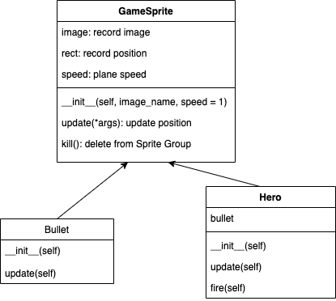

Aircraft game
=================

   * [Preparation](#preparation)<br>
   * [Step 1: Use pygame to create GUI](#step-1-use-pygame-to-create-gui)<br>
               * [Game init and quit   <em>(LN_01)</em>](#game-init-and-quit---ln_01)<br>
               * [Know coordinates   <em>(LN_02)</em>](#know-coordinates---ln_02)<br>
               * [Create main window  <em>(LN_03)</em>](#create-main-window--ln_03)<br>
   * [Step 2: Use image folder](#step-2-use-image-folder)<br>
               * [Load the image (image.load)](#load-the-image-imageload)<br>
               * [Allocate the image (window.blit)](#allocate-the-image-windowblit)<br>
               * [Update all the window and see the outcome (display.update)](#update-all-the-window-and-see-the-outcome-displayupdate)<br>
               * [Example <em>(LN_04)</em> <em>(LN_05)</em>](#example-ln_04-ln_05)<br>
   * [Step 3: Make image move and Game loop](#step-3-make-image-move-and-game-loop)<br>
               * [How to make image move?](#how-to-make-image-move)<br>
               * [We have two things to do when we make a game](#we-have-two-things-to-do-when-we-make-a-game)<br>
               * [Time clock <em>(LN_06)</em>](#time-clock-ln_06)<br>
               * [Make heroplane move  <em>(LN_07)</em>](#make-heroplane-move--ln_07)<br>
               * [Check user input in game loop <em>(LN_08)</em>](#check-user-input-in-game-loop-ln_08)<br>
   * [Step 4: Sprite and Sprite group (OOP)](#step-4-sprite-and-sprite-group-oop)<br>
               * [Sprite is a object that combine image and rect location together (Easy way)](#sprite-is-a-object-that-combine-image-and-rect-location-together-easy-way)<br>
               * [Create GameSprite class  <em>(GM_plane_sprites)</em>](#create-gamesprite-class--gm_plane_sprites)<br>
               * [Use GameSprite and Sprite Group to create enemy <em>(LN_09)</em>](#use-gamesprite-and-sprite-group-to-create-enemy-ln_09)<br>
   * [Game Framework(use OOP)*](#game-frameworkuse-oop)<br>
         * [Know about the main program](#know-about-the-main-program)<br>
            * [Game init:](#game-init)<br>
            * [Game loop:](#game-loop)<br>
   * [Game background*](#game-background)<br>
   * [Enemy*](#enemy)<br>
            * [Timer](#timer)<br>
            * [Create event and check this event](#create-event-and-check-this-event)<br>
            * [Create Enemy](#create-enemy)<br>
   * [Hero and bullet*](#hero-and-bullet)<br>
            * [Hero](#hero)<br>
            * [Bullet](#bullet)<br>
            * [Create hero class](#create-hero-class)<br>
            * [Move hero](#move-hero)<br>
            * [Hero can shoot bullet](#hero-can-shoot-bullet)<br>
            * [Create Bullet class](#create-bullet-class)<br>
            * [Bullet shoot](#bullet-shoot)<br>
   * [Collision*](#collision)<br>
            * [Groupcollide](#groupcollide)<br>

# Preparation

1. ##### Pycharm 2020.1( I think other vision is also fine)


2. ##### Pygame 2.0.0  You must install v2.0.0+ in oder to success

   1. There are two ways to install pygame
      1. Terminal -> ```python3 -m pip install -U pygame==2.0.0.dev6 --user```
      2. Pycharm -> Preference -> Project -> Project Interpreter -> + ->search pygame -> specify v2.0.0+
   2. Then, use `python3 -m pygame.examples.aliens` to check if it is install successfully, if sucessful, it will run a game on your laptop.

   

3. ##### Mac OS Catalina v 10.15.5

   1. In this project, all the thing is based on MacOS

4. ##### The image folder

   1. This is the folder contains all the images we need

# Step 1: Use pygame to create GUI

1. ##### Game init and quit   *(LN_01)*

```python
import pygame

pygame.init()			#init 
print("Game Coding...")	#coding
pygame.quit()			#quit
```

2. ##### Know coordinates   *(LN_02)*

   1. ```pygame.Rect(x,y,weith,height)``` is used to create a rectangle.
   2. Upper left corner  is the origin (0,0). We can set all object based on that origin.

3. ##### Create main window  *(LN_03)*

   1. ```pygame.display```

      | `pygame.display.set_mode((width,height),flags,depth)` | Initilize the window        |
      | ----------------------------------------------------- | --------------------------- |
      | `pygame.display.update()`                             | update the things in window |

# Step 2: Use image folder

1. ##### Load the image (image.load)

   1. Use   ```pygame.image.load()``` to load image

2. ##### Allocate the image (window.blit)

   1. Use the windows object to use ```window.blit(image object,(width,height))``` method to allocate the image

3. ##### Update all the window and see the outcome (display.update)

   1. Use```pygame.display.update()``` to update all the window and see the outcome

4. ##### Example *(LN_04)* *(LN_05)*

   1. Create background  *(LN_04)*
   2. Create heroplane  *(LN_05)*

# Step 3: Make image move and Game loop

1. ##### How to make image move?

   1. Refresh frame to make image move

2. ##### We have two things to do when we make a game

   1. Game init:
      1. Set up windows (Step 1)
      2. Create image and allocate them (Step 2)
      3. Time clock

   1. Game loop:
      1. Set refresh rate
      2. Check User Input
      3. Update image location
      4. Pygame.display.update  *(All)*

3. ##### Time clock *(LN_06)*

   1. when in game init, use ```pygame.time.Clock``` to create a clock object
   2. when in game lopp, let clock object use ```tick``` method

4. ##### Make heroplane move  *(LN_07)*

   1. use rect to remember the position of hero
   2. change  position of hero
   3. use blit method(**Remember to blit the background also in order to have only one plane**)
   4. use update method
   5. make hero plane will come back from the buttom

5. ##### Check user input in game loop *(LN_08)*
   1. use ```pygame.event.get() -> list of input``` to get the current user input
   2. how to check the quit user input

   ```python
   for event in pygame.event.get():
       if event.type == pygame.QUIT:
           pygame.quit()
           exit()
   ```

# Step 4: Sprite and Sprite group (OOP)

1. ##### Sprite is a object that combine image and rect location together (Easy way)

   1. Game init:
      1. Create sprite
      2. Create sprites group
   2. Game loop:
      1. Update sprites group
      2. draw sprites group on window
      3. update the window

<div align=center>
   
</div>

<div align=center></div>

2. ##### Create GameSprite class  *(GM_plane_sprites)*

   1. if a class is not inherit from object, need to super().\__init__()

   <div align=center>
      
   </div>

   2. Image have ```get_rec()``` method to return a object

3. ##### Use GameSprite and Sprite Group to create enemy *(LN_09)*

   1. Game init:
      1. Create sprite by ```GameSprite("img", speed)```
      2. Create sprites group by ```pygame.sprite.Group(*args)```
   2. Game loop:
      1. Update sprites group by ```group.update()```
      2. draw sprites group on window  ``group.draw(window)``
      3. update the window ```pygame.display.update()```

# Game Framework(use OOP)*

### Know about the main program

<div align=center>
   
</div>

1. #### Game init:

   1. Create Game window
   2. Create Game clock
   3. Create sprites and sprites Group

2. #### Game loop:

   1. Set refresh rate
   2. Check User Input
   3. Check collision
   4. Update and draw sprites Group
   5. update the window ```pygame.display.update()```

# Game background*

1. Use two background images, place one on another, swipe down this two image together. When the buttom one disappear at the buttom, move it to the top, continuely doing that, make the background moving.
2. Create a Background class which inherit the GameSprite class, also overwrite the update method with jusitify if the background already out of the window.

<div align=center>
   
</div>

```python
class Background(GameSprite):
    """Background class"""

    def __init__(self, is_alt=False):
        super().__init__("./images/background.png")
        if is_alt:
            self.rect.y = - self.rect.height

    def update(self):
        super().update()
        # 1. justify if the img out of window
        if self.rect.y >= WINDOW_RECT.height:
            self.rect.y = - self.rect.height
```

# Enemy*

1. #### Timer

   1. Use timer to create an enemy plane in a certain time
   2. Every second there is a new enemy plane come
   3. Every enemy plane has different speed
   4. Use```pygame.time.set_timer(eventid, milliseconds)``` to add timer

2. #### Create event and check this event

   1. Create Time event

      ```python
      # constant for enemy timer event
      ENEMY_TIMER = pygame.USEREVENT
      
      pygame.time.set_timer(ENEMY_TIMER, 1000)
      ```

   2. Check event

      ```python
      def __event_handler(self):    
          for event in pygame.event.get():
              if event.type == pygame.QUIT:
                  AircraftGame.__game_over()
              elif event.type == ENEMY_TIMER:				#check if it is enmey_timer
                  print("Enemy come")
      ```

3. #### Create Enemy

   <div align=center>
      
   </div>

   1. Create Enemy class inherit from GameSprite

      1. Overwrite \__init__ method to specify the speed and the position of the enemy plane
      2. Overwrite update method to kill the enemy plane when it is out of screen

      ```python
      class Enemy(GameSprite):
          """Enemy class"""
      
          def __init__(self):
              super().__init__("./images/enemy1.png")
              self.speed = random.randint(2, 4)
              self.rect.bottom = 0
              max_x = WINDOW_RECT.width - self.rect.width
              self.rect.x = random.randint(0, max_x)
      
          def update(self):
              super().update()
              if self.rect.y >= WINDOW_RECT.height:
                  self.kill()
      ```

   2. Initialize every enemy when the time event occur

      1. Make a enemy_group
      2. Use event_handler method to check if the time event occer and then create a enemy in the enemy_group
      3. Use update_sprites method to update enemy_group and draw it

# Hero and bullet*

1. #### Hero

   1. Hero is 120px away from the buttom. When the game begins, hero will at the center of the window
   2. 3 bullets/ 0.5 second
   3. Hero cannot move in default, only move when get commend from keyboard, so the origin speed is 0.

2. #### Bullet

   1. Bullet is shooting in a line
   2. When it is out of window, need to be delete from bullet_group
   3. The speed of bullet needs to be a nagetive number

   <div align=center>
      
   </div>

3. #### Create hero class

   1. Create hero class inherit from GameSprite
      1. Overwrite \__init__ method to specify the speed and the position of the hero

      2. Overwrite update to specify the speed of hero

      3. have a fire() method which can shoot bullet

         ```python
         class Hero(GameSprite):
             """Hero class"""
             def __init__(self):
                 super().__init__("./images/me1.png", 0)
                 self.rect.centerx = WINDOW_RECT.centerx
                 self.rect.bottom = WINDOW_RECT.bottom - 120
         ```

4. #### Move hero

   1. There are two ways to get the input,

      1. the **first** is traverse the event type. In this way, need to continuous press button.

         ```python
         elif event.type == pygame.KEYDOWN and event.key == pygame.K_RIGHT:
             print("right")
         ```

      2. the **second** is use ```pygame.key.get_pressed() -> all button tuple``` **Recommend**

         ```python
         keys_pressed = pygame.key.get_pressed()
         if keys_pressed[pygame.K_RIGHT]:
             print("right")```
         ```

   2. Move hero

      1. Change the update of hero, if get button press, then give hero a speed to move horizontal

         ```python
         def update(self):
             self.rect.x += self.speed
         ```

      2. Set the speed of hero when get keyboard input 

         ```python
         keys_pressed = pygame.key.get_pressed()
         if keys_pressed[pygame.K_RIGHT]:
             self.hero.speed = 3
         elif keys_pressed[pygame.K_LEFT]:
             self.hero.speed = -3
         else:
             self.hero.speed = 0
         ```

   3. Avoid hero going out

      1. check the x and right of hero and set a number, if the hero is out of that number, pull it back by reseting its x value

         ```python
         def update(self):
             self.rect.x += self.speed
             if self.rect.x < 0:
                 self.rect.x = 0
             elif self.rect.right > WINDOW_RECT.right:
                 self.rect.right = WINDOW_RECT.right
         ```

5. #### Hero can shoot bullet

   1. set timer for shooting 

      ```python
      BULLET_TIMER = pygame.USEREVENT + 1 # because the pygame.USEREVENT used by enemy
      ```

   2. use set_timer in the \__init__ method

      ```python
      def __init__(self):
      	pygame.time.set_timer(BULLET_TIMER, 500)
      ```

   3. check the event in game loop

6. #### Create Bullet class

   1. Create bullet class inherit from GameSprite

      1. Overwrite \__init__ method to specify the speed of bullet

      2. Overwrite update method to kill the bullet when it is out of window

         ```python
         class Bullet(GameSprite):
             """Bullet class"""
         
             def __init__(self):
                 super().__init__("./images/bullet1.png", -2)
         
             def update(self):
                 super().update()
                 if self.rect.bottom < 0:
                     self.kill()
         
             def __del__(self):
                 print("kill")
         ```

7.  #### Bullet shoot

   1. Make a bullet_group in Hero class

      ```python
      class Hero(GameSprite):
      	def __init__(self):
      		self.bullets = pygame.sprite.Group()
      ```

   2. Use update_sprites method to update bullet_group and draw it

      ```python
      def __update_sprites(self):
      	self.hero.bullets.update()
              self.hero.bullets.draw(self.window)
      ```

   3. Change the fire method of hero to shoot bullet

      ```python
      def fire(self):
          # 1. Make a bullet sprites
          bullet = Bullet()
          # 2. Set the position
          bullet.rect.bottom = self.rect.y - 20
          bullet.rect.centerx = self.rect.centerx
          # 3. add it to group
          self.bullets.add(bullet)
      ```

   4. Shoot 3 bullets at one time

      Use a loop to shoot and set the position

      ```python
      def fire(self):
          for i in (0, 1, 2):
              # 1. Make a bullet sprites
              bullet = Bullet()
              # 2. Set the position
              bullet.rect.bottom = self.rect.y - i * 20 # set the position
              bullet.rect.centerx = self.rect.centerx
              # 3. add it to group
              self.bullets.add(bullet)
      ```

# Collision*

1. #### Groupcollide

   ```pygame.sprite.groupcollide(group1, group2, dokill1, dokill2, collided = None) -> Sprite_dict```

   1. dokill1 is for group1 and dokill2 is for group2, when dokill is True, the object which collide will be destroyed.

      ```python
      def __check_collision(self):
          # 1. bullet kill enemy
          pygame.sprite.groupcollide(self.hero.bullets, self.enemy_group, True, True)
          # 2. Enemy kill hero
          collide = pygame.sprite.groupcollide(self.hero_group, self.enemy_group, True, True)
          if len(collide) > 0:
              AircraftGame.__game_over()
      ```

